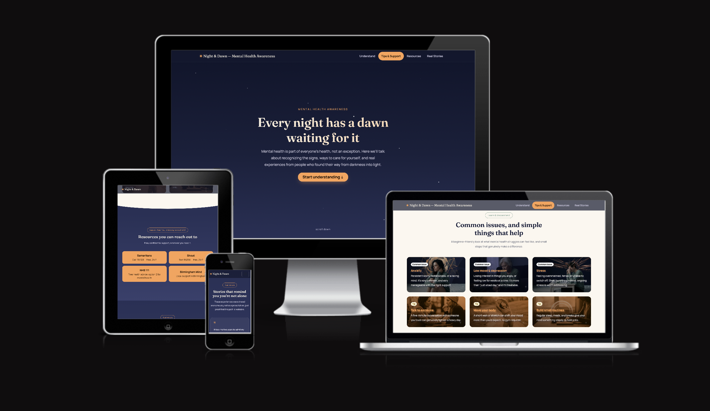
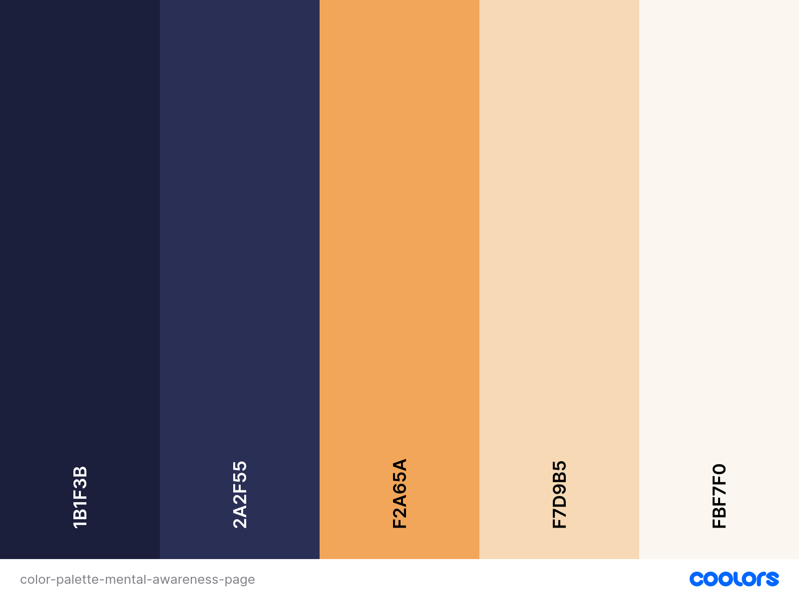
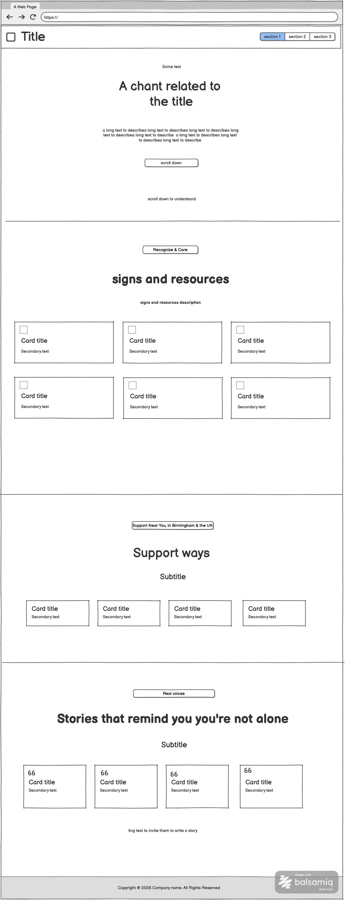
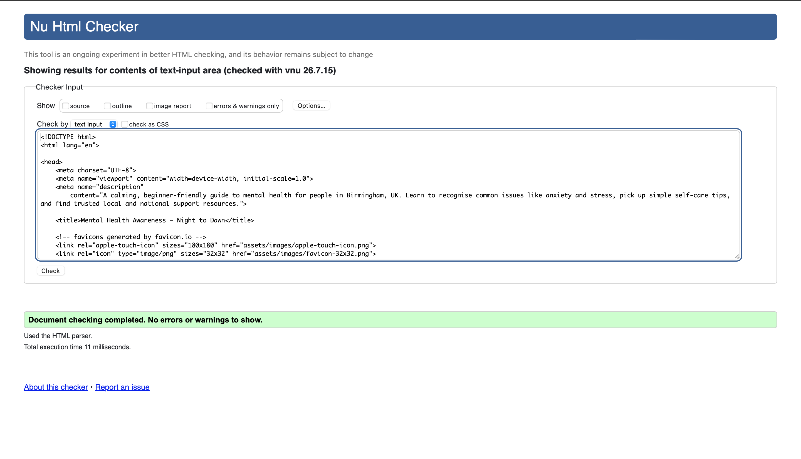
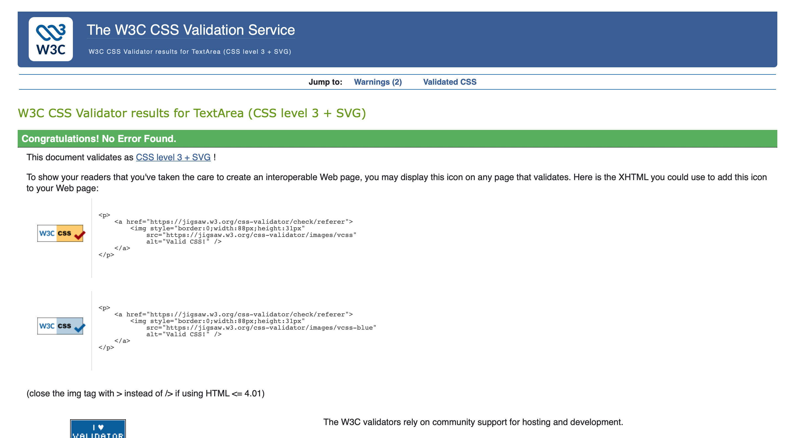
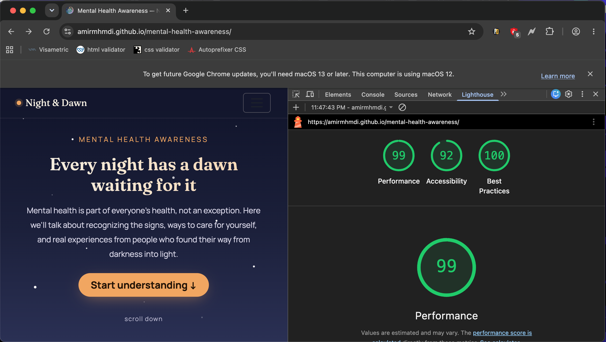

# Mental Health Awareness — Birmingham

[View the live project here](https://amirmhmdi.github.io/mental-health-awareness/)

A calming, single-page website that helps people in Birmingham, UK recognise common mental health issues, pick up simple everyday self-care tips, and find trusted local and national support resources.



---

## Table of Contents

- [User Experience (UX)](#user-experience-ux)
  - [User Stories](#user-stories)
  - [Design](#design)
    - [Colour Scheme](#colour-scheme)
    - [Typography](#typography)
    - [Imagery](#imagery)
  - [Wireframes](#wireframes)
- [Features](#features)
- [Technologies Used](#technologies-used)
  - [Languages Used](#languages-used)
  - [Frameworks, Libraries & Programs Used](#frameworks-libraries--programs-used)
- [Testing](#testing)
  - [Testing User Stories from the UX Section](#testing-user-stories-from-the-user-experience-ux-section)
  - [Further Testing](#further-testing)
- [Deployment](#deployment)
- [Credits](#credits)
  - [Code](#code)
  - [Content](#content)
  - [Media](#media)
  - [Acknowledgements](#acknowledgements)

---

## User Experience (UX)

### User Stories

- **As a visitor**, I want to see a warm, encouraging message as soon as I land on the page, so I feel comfortable and safe to keep reading. `Must Have`
- **As a beginner learning about mental health**, I want simple cards explaining common issues and everyday tips, so I can understand the basics without feeling overwhelmed. `Must Have`
- **As a user**, I want a clear set of links to trusted mental health resources, so I know where to go if I need more support. `Must Have`
- **As a visitor**, I want to see a few short, uplifting messages, so I leave the page feeling a bit more encouraged. `Should Have`
- **As a mobile user**, I want the page to work well on my phone, so I can read it comfortably anywhere. `Must Have`

### Design

#### Colour Scheme

The palette is built around a "night into dawn" metaphor for mental wellbeing: deep, calming indigo tones for structure and trust, paired with a warm dawn-orange accent for hope and encouragement. Sage green is used sparingly for supportive, secondary actions.



#### Typography

- **[Fraunces](https://fonts.google.com/specimen/Fraunces)** is used for all headings. Its soft, editorial serif shapes give the page a warm, human feel rather than a clinical one.
- **[Manrope](https://fonts.google.com/specimen/Manrope)** is used for all body text and UI elements. It's a clean, highly legible sans-serif that keeps longer passages of supportive text easy to read.
- Both fonts are imported from **Google Fonts**, with a `sans-serif` fallback stack for resilience.

#### Imagery

The site favours colour, gradients, and simple SVG shapes over photography, to keep the tone calm and avoid any imagery that could feel clinical or triggering. Where custom illustrative assets were needed (such as the favicon and any supporting graphics), they were generated using **Google Gemini's "Nano Banana" image generation model** and lightly adjusted to match the site's colour palette.

### Wireframes

Wireframes were created in **Balsamiq** before development began, to plan the layout and content hierarchy of each section.



---

## Features

- **Responsive on all device sizes** — built with Bootstrap's grid system, tested from small mobile screens up to large desktop displays.
- **Sticky, collapsible navigation bar** — shows all section links on larger screens and collapses into a hamburger menu on mobile, with the active section highlighted automatically as the user scrolls.
- **Calming hero section** — an encouraging headline and message that sets a supportive tone from the first screen.
- **Information cards** — clearly organised Bootstrap cards explaining common mental health issues alongside practical, everyday self-care tips.
- **Resource links** — a grid of stand-out buttons linking directly to trusted local (Birmingham Mind) and national (Samaritans, Shout, NHS 111) support services.
- **Positive affirmations** — a short, uplifting closing message to leave visitors feeling encouraged.
- **Interactive elements** — hover and scroll-based animations (card lift effects, a twinkling star field, smooth scrolling, and scroll-based navigation highlighting) that add life to the page without being distracting.
- **Accessible, semantic markup** — clear heading structure, sufficient colour contrast, and visible focus states throughout.
- **Custom 404 error page** — a themed "page not found" screen matching the site's night-to-dawn design, so users who hit a broken link still get a calm, on-brand experience with a clear way back home.

---

## Technologies Used

### Languages Used

- [HTML5](https://en.wikipedia.org/wiki/HTML5)
- [CSS3](https://en.wikipedia.org/wiki/Cascading_Style_Sheets)

### Frameworks, Libraries & Programs Used

- **[Bootstrap 5](https://getbootstrap.com/)** — used throughout the project for the responsive grid system, navbar component, cards, and buttons.
- **[Google Fonts](https://fonts.google.com/)** — used to import the Fraunces and Manrope typefaces used across the site.
- **[Balsamiq](https://balsamiq.com/)** — used to design the wireframes during the planning stage of the project.
- **[Google Gemini ("Nano Banana")](https://gemini.google.com/)** — used to generate the custom imagery and favicon graphic used on the site.
- **[Git](https://git-scm.com/)** — used for version control, committing changes locally throughout development.
- **[GitHub](https://github.com/)** — used to store the project's code remotely and to deploy the live site via GitHub Pages.
- **[Favicon.io](https://favicon.io/)** — used to generate the favicon files (`apple-touch-icon.png`, `favicon-32x32.png`, `favicon-16x16.png`) in multiple sizes for cross-browser and cross-device support.

---

## Testing

The [W3C Markup Validator](https://validator.w3.org/) and [W3C CSS Validator](https://jigsaw.w3.org/css-validator/) services were used to validate the project's HTML and CSS, to ensure there were no syntax errors.

**W3C HTML Validator Results**



**W3C CSS Validator Results**



**Lighthouse Report**
 
Google Chrome's Lighthouse tool was used to test the site's performance, accessibility and best practices.
 


### Testing User Stories from the User Experience (UX) Section

#### First Time Visitor Goals

A first-time visitor should immediately understand what the site is for and feel reassured, not overwhelmed. This was tested by confirming that the hero section loads with a clear, encouraging message within the first screen, with no unnecessary scrolling or clutter. The navigation bar was checked to ensure all four sections (Understand, Tips & Support, Resources, Stories) are visible and clearly labelled at a glance, so a new visitor can quickly see the full scope of the page. The information cards were reviewed to confirm the language used is simple and free of clinical jargon, so someone with no prior knowledge of mental health topics can follow along comfortably.

#### Returning Visitor Goals

A returning visitor is more likely to be looking for something specific, such as a particular support resource or a tip they remember reading. This was tested by confirming the navbar remains sticky and accessible while scrolling, so a returning user can jump straight to the Resources section without having to scroll back to the top of the page. The active-section highlighting in the navbar was also tested, to confirm it updates correctly as the user scrolls, giving clear orientation on longer visits. Resource links were checked to confirm they open in a new tab, so a returning visitor doesn't lose their place on the page when following an external link.

#### Frequent User Goals

A frequent user is likely to revisit the page occasionally as a quick reminder or to share it with someone else. This was tested by confirming that the page loads quickly on repeat visits, that all content remains consistent between visits, and that the affirmations and tips are varied enough to still feel useful on repeat reads. The page's mobile layout was also retested on multiple occasions to confirm that a frequent user checking the site from their phone, rather than their desktop, always gets the same clear, well-organised experience.

### Further Testing

- The website was tested on Google Chrome, Mozilla Firefox and Safari browsers.
- The website was viewed on a variety of devices, including desktop, laptop, iPhone SE, iPhone 12 and iPad.
- A large amount of testing was carried out to ensure that all navigation links and resource links worked correctly and pointed to the right destination.
- Friends and family members were asked to review the site and its documentation to point out any bugs or user experience issues.
- AI tools were used throughout development to help debug layout and JavaScript issues, and to help generate some of the page's interactive animations (such as the scroll-based navigation highlighting and card hover effects), which were then reviewed and adjusted manually.
- The custom 404 page was tested by manually navigating to a non-existent URL, to confirm it displays correctly and that the "Back to home" link works as expected.

---

## Deployment

### GitHub Pages

The site was deployed to GitHub Pages using the following steps:

1. Log in to [GitHub](https://github.com/) and locate the [GitHub repository](https://github.com/amirmhmdi/mental-health-awareness) for this project.
2. At the top of the repository, click on the **Settings** tab.
3. From the left-hand menu, select **Pages**.
4. Under **Build and deployment**, set the **Source** to **Deploy from a branch**.
5. Under **Branch**, select **main** and the **/ (root)** folder, then click **Save**.
6. GitHub will build the page; after a few minutes, refresh the Pages settings screen to see the live link displayed at the top of the section.
7. The live link can now be shared and should be added to the top of this README.
8. A custom `404.html` page is included in the root of the repository. GitHub Pages automatically serves this file whenever a visitor requests a URL that doesn't exist, with no additional configuration required.

The live link can be found here: **[https://amirmhmdi.github.io/mental-health-awareness/](https://amirmhmdi.github.io/mental-health-awareness/)**

### Forking the GitHub Repository

Forking a repository allows you to create a copy of the original repository on your own GitHub account, so you can view and make changes without affecting the original project. To fork this repository:

1. Log in to [GitHub](https://github.com/) and locate the [GitHub repository](https://github.com/amirmhmdi/mental-health-awareness) for this project.
2. At the top right of the repository, above "Settings," click the **Fork** button.
3. This will create a copy of the repository in your own GitHub account.

### Making a Local Clone

Cloning a repository allows you to download a full copy of the project to your own computer, including its entire commit history. To make a local clone of this project:

1. Log in to [GitHub](https://github.com/) and locate the [GitHub repository](https://github.com/amirmhmdi/mental-health-awareness) for this project.
2. Click the green **Code** button above the list of files.
3. Choose whether to clone using **HTTPS**, **SSH**, or **GitHub CLI**, and copy the URL shown.
4. Open **Git Bash** or your terminal of choice, and change the current working directory to the location where you want the cloned directory to be created.
5. Type the following command, pasting in the URL you copied:
   ```bash
   git clone https://github.com/amirmhmdi/mental-health-awareness.git
   ```
6. Press **Enter** to create the local clone.
7. Navigate into the new folder and open `index.html` in your browser to view the project locally:
   ```bash
   cd mental-health-awareness
   ```

No build steps, package installs, or environment setup are required, as this project is built with plain HTML, CSS, and CDN-hosted Bootstrap, so it can be opened directly in a browser after cloning.

---

## Credits

### Code

- **[Bootstrap 5 Documentation](https://getbootstrap.com/docs/5.3/getting-started/introduction/)** — referenced throughout the project for the grid system, navbar component, cards, and button styling.
- **[MDN Web Docs — Intersection Observer API](https://developer.mozilla.org/en-US/docs/Web/API/Intersection_Observer_API)** — referenced when building the scroll-based logic that highlights the active section in the navigation bar.
- AI tools were used to help debug HTML, CSS, and JavaScript issues during development, and to help generate some of the page's interactive animations, which were then reviewed, tested, and adjusted by the developer to fit the project.

### Content

- All content was written by the developer with the help of AI.
- The background reading on the [psychological properties of colour](http://www.colour-affects.co.uk/psychological-properties-of-colours) informed some of the colour choices described in the Design section of this README.

### Media

- The favicon and supporting imagery were generated using Google Gemini's "Nano Banana" image generation model.

### Acknowledgements

- Thanks to my mentor for their continuous, helpful feedback throughout the project.
- Thanks to friends and family for testing the site and providing honest feedback on its content and usability.